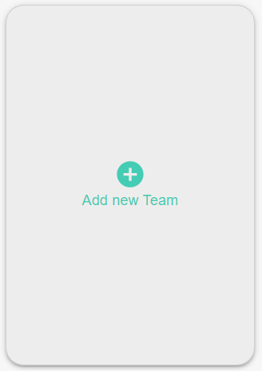

# AddNewButton

An insert button that can be changed in size and shape, compatible with your page content instead of traditional buttons. 



#### Props

- `addNew`: Chooses the conten of the title.
- `backgorundColor`: Chooses the color of the bar.
-`color`: Chooses the color of the title.
-`type`: Selects the type of the button, "wideButton" is wide and "largeButton" is long.
-`onClickFunction`: Selects which function is triggered when the button is clicked


## Usage

Here is a sample usage of the `AddNewButton` component:

```jsx
<AddNewButton AddNew="Team" backgroundColor=”black” color=”gold” type=”largeButton” onClickFunction={()=>openWizard()} />
```

