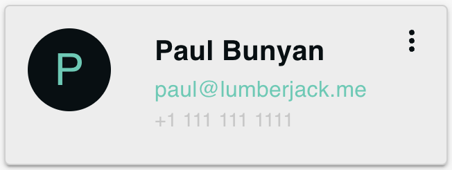

# ColleagueCard

The `ColleagueCard` component serves as a visual representation of a colleague's information. It is a card-style component that encapsulates multiple details about a colleague including their avatar, name, email, and phone number. Additionally, it allows users to edit or delete the card through a dropdown menu.

## Props

Here is a list of props that the `ColleagueCard` component accepts:

- `colleague`: The colleague object containing `name`, `email`, `phone`, and optional `systemMessage` for backstory.
- `onColleagueClick`: Callback function for clicking on the card.
- `onDelete`: Callback function for deleting the card.
- `onEdit`: Callback function for editing the card.
- `fontSize`: Sets the font size for the avatar text. Default is `"large"`.
- `isLastColleague`: A boolean to check if the current card is the last one. Used to disable delete option.
- `topBar`: Boolean to show/hide the top bar of the card.
- `showBackstory`: Boolean to show/hide the backstory of the colleague.
- `responsive`: Sets the responsive layout.

## Sub-components

- **Avatar**: This sub-component will display the avatar of the colleague. (Coming Soon)
- **ContactDetails**: This sub-component will show the name, email, and phone number of the colleague. (Coming Soon)
