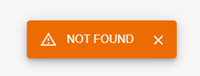

# GlobalSnackMessage

Event listeners that you can add to interceptors with nucleoid synpases, a component that allows you to display all response/request errors as pop-ups on the screen in the form of an error message.

