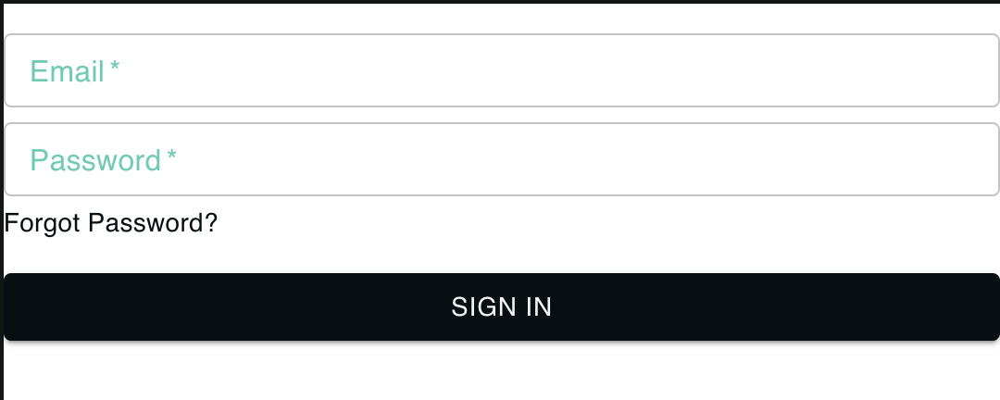

# NucleoidLoginForm

The `NucleoidLoginForm` component provides a form for email and password input, which is designed for user authentication. It also includes a "Forgot Password?" link and a "Sign In" button.



## Props

The `NucleoidLoginForm` component accepts the following props:

- `email`: A string representing the email value.
- `password`: A string representing the password value.
- `setEmail`: A function for setting the email value.
- `setPassword`: A function for setting the password value.
- `onSubmit`: A function that is called when the form is submitted.

## Usage

Here is a sample usage of the `NucleoidLoginForm` component:

```jsx
<NucleoidLoginForm
  email={email}
  password={password}
  setEmail={setEmail}
  setPassword={setPassword}
  onSubmit={onSubmit}
/>
```
