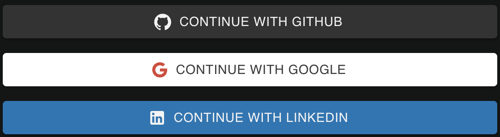

# SocialLoginButtons

The `SocialLoginButtons` component provides buttons for social login via GitHub, Google, and LinkedIn. Each button can be conditionally rendered based on the props.



## Props

The `SocialLoginButtons` component accepts the following props:

- `googleEnable`: A boolean that specifies whether to display the Google login button.
- `onGoogle`: A function that is called when the Google login button is clicked.
- `githubEnable`: A boolean that specifies whether to display the GitHub login button.
- `onGithub`: A function that is called when the GitHub login button is clicked.

- `linkedinEnable`: A boolean that specifies whether to display the LinkedIn login button.
- `onLinkedin`: A function that is called when the LinkedIn login button is clicked.

## Usage

Here is an example of how to use the `SocialLoginButtons` component:

```jsx
<SocialLoginButtons
  googleEnable={true}
  onGoogle={handleGoogleLogin}
  githubEnable={true}
  onGithub={handleGithubLogin}
  linkedinEnable={true}
  onLinkedin={handleLinkedinLogin}
/>
```
