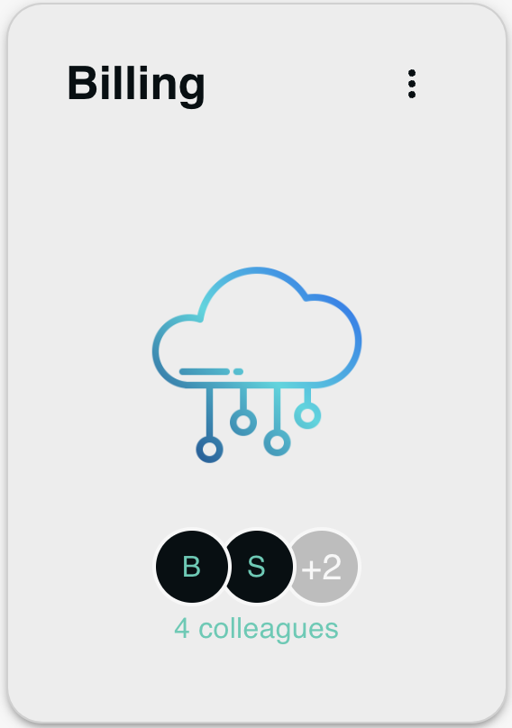

# TeamCard

The `TeamCard` component serves as a visual container for a team's information. It displays the team's name, an icon representing the team, and avatars of the team members. Moreover, it allows the user to edit or delete the team through an interactive menu.



## Props

- `team`: An object that contains information about the team, including `name`, `src` for the team logo, and `members`.
- `onTeamClick`: Callback function that's called when the team name is clicked.
- `onColleagueClick`: Callback function for clicking on an avatar from the `AvatarGroup`.
- `onDelete`: Callback function for deleting the team.
- `onEdit`: Callback function for editing the team details.

## Sub-components

- [**TextLabeledAvatarGroup**](./textlabeledavatargroup): This sub-component displays a group of avatars representing team members along with their initials as text labels. It also reports the total number of colleagues in the team.

## Usage Examples

```jsx
<TeamCard
  team={{
    name: "Team A",
    src: "/path/to/team-icon.png",
    members: [
      { id: 1, name: "Alice" },
      { id: 2, name: "Bob" },
    ],
  }}
  onTeamClick={() => {}}
  onColleagueClick={(id) => {}}
  onDelete={(id) => {}}
  onEdit={() => {}}
/>
```
