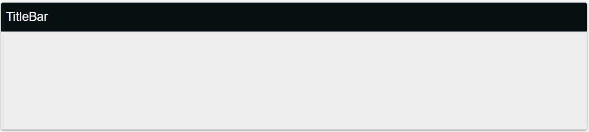

# TitleBar

You can use TitleBar to add stunning titles to any Card. 



#### Props

- `title`:  String value representing conten of the title.
- `barColor`: String value representing the color of the bar.
- `titleColor`: String value representing the color of the title.

 ## Usage

Here is a sample usage of the `TitleBar` component:

```jsx
<TitleBar  title=”Performance”  barColor=”black”  titleColor=”white” />
```


