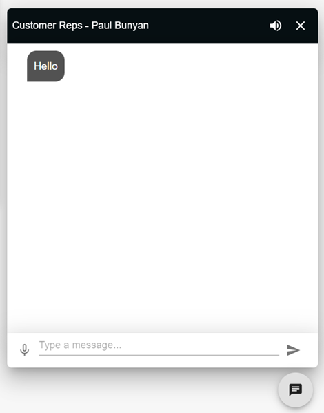

# ChatWidget



The `ChatWidget` creates a colleague chat that connects to flowise servers. Sends the user's message and the system message of the colleague who will reply to the flowise servers, communicates with the user by transferring the reply to the popChat component

## Features

- **Connect Flowise**: Sends Colleague's SystemMessage and User message to flowise and receives the response.
- **PopChat**: Floating component in a pop-up designed page that displays incoming and outgoing messages.

## Usage

Here is a usage example:

```jsx
<ChatWidget />
```


