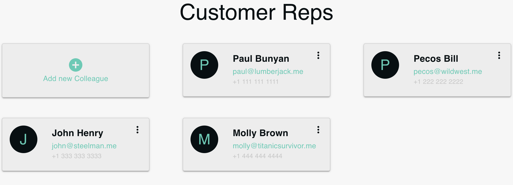

# ColleaguesWidget



The `ColleaguesWidget` component is designed to display a list of colleagues. The component fetches colleague data from the server via API calls and renders each colleague in individual `ColleagueCard` components. Additionally, an `AddItemButton` is provided to add new colleagues.

## Features

- **API Calls**: Makes asynchronous calls to fetch colleague data from the server.
- **ColleagueCards**: Dynamically renders the list of colleagues using `ColleagueCard` components.
- **AddItemButton**: Allows users to add new colleagues, triggering a specific action or form.

## Usage

Here is a usage example:

```jsx
<ColleaguesWidget />
```
