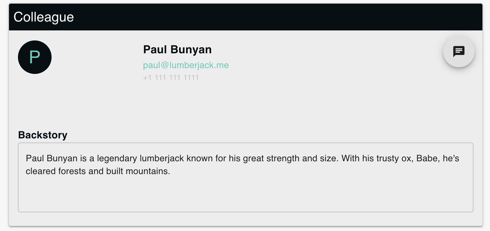

# ColleagueWidget



**Note**: This component is currently under development.

The `ColleagueWidget` component is designed to display a ColleagueCard. The component includes a title bar, a `TextFieldWithTitle` for backstory,

## Props

As the component is still under development, the props are yet to be finalized. Some potential props could include:

- `colleagues`: An array of colleague objects to display.

## Components

[**Title Bar**](../components/titlebar): Displays the title of the widget.

[**TextfieldWithTitle**](../components/textfieldwithtitle): Allows users to search or filter the list of colleagues.

[**ColleagueCard**](../components/colleaguecard): Displays the colleague.

## Usage

Here is a potential usage example:

```jsx
<ColleagueWidget colleagues={colleagueData} onSearch={handleSearch} />
```
