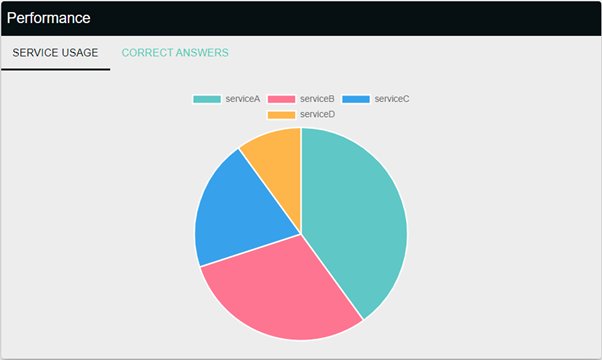
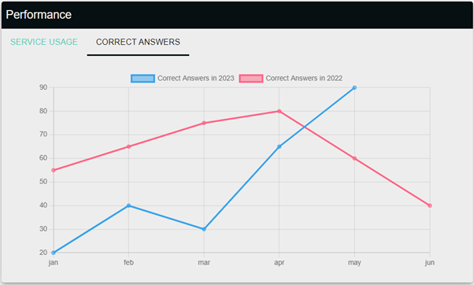

# PerformanceWidget




PerformanceWidget makes API Call for selected colleague's answer data and service usages and shows them in pie graph and line graph. 

## Features

- **API Calls**: Makes asynchronous calls to fetch colleagues graph's data from the server.
- **Pie Graph**: Display Colleague's service usages data
- **Line Graph**: Display Colleague's answer data


## Usage

Here is a usage example:

```jsx
<PerformanceWidget />
```
