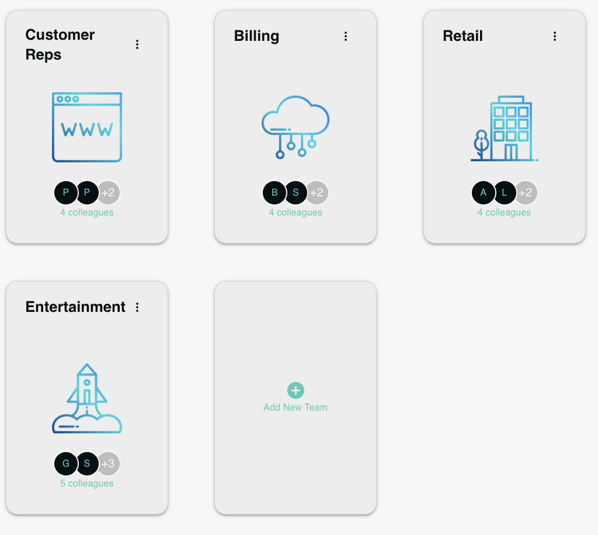

# TeamsWidget



The `TeamsWidget` component is designed to display a list of teams. The component fetches team data from the server via API calls and renders each team in individual `TeamCard` components. Additionally, an `AddItemButton` is provided to add new teams.

## Features

- **API Calls**: Makes asynchronous calls to fetch team data from the server.
- **TeamCards**: Dynamically renders the list of teams using `TeamCard` components.
- **AddItemButton**: Allows users to add new teams, triggering a specific action or form.

## Usage

Here is a usage example:

```jsx
<TeamsWidget />
```
