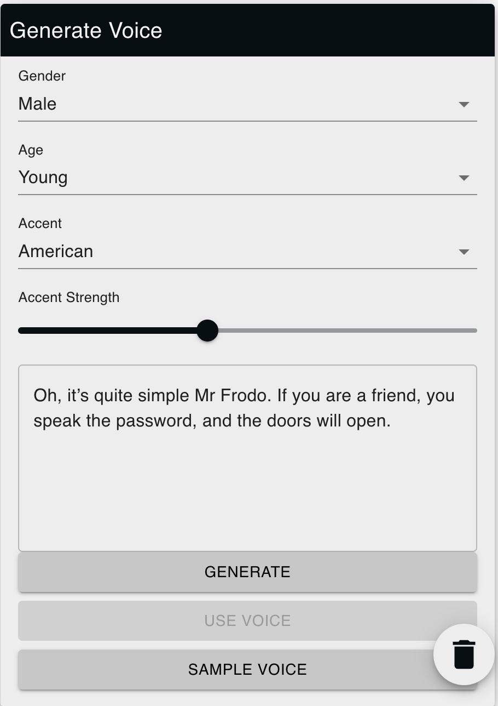

# VoiceGeneratorWidget

The `VoiceGeneratorWidget` component serves as the UI for generating synthetic voices. It allows users to specify voice characteristics, such as gender, age, and accent, and provides a voice sample based on those settings.

## Props

- **colleague**: An object containing colleague details like `id` and optionally `voiceId`.

## Features

- **Voice Customization**: Utilizes settings to specify the gender, age, and accent for the generated voice.
- **Voice Sampling**: Provides functionality to preview a sample of the generated voice.

- **Voice Persistence**: Includes an option to save the generated voice for future use.

- **Loading Indicators**: Gives visual feedback when the system is generating or sampling the voice.
